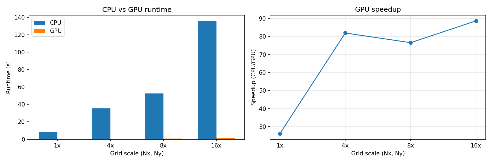

# Assignment 7: CPU vs GPU OpenMP Benchmark (CFD Euler)

[](https://classroom.github.com/a/JdNTJJYf)
# Homework 7: CPU vs GPU OpenMP Benchmark (CFD Euler)

```bash
module load nvhpc
module load nvhpc
module load cuda
nvc++ -mp=gpu -gpu=cc75 -Ofast laplace2d.cpp -o laplace -Minfo=accel,mp
srun -p gpu --gres=gpu:1 --ntasks=1 --time=00:05:00 --mem=40G ./laplace
```

1. CPU benchmark baseline: [cfd_euler_lab3.cpp](cfd_euler_lab3.cpp)
2. GPU offload version: [cfd_euler.cpp](cfd_euler.cpp)

The GPU version applies OpenMP target offload analogous to CPU loop parallelism:

1. Uses OpenMP data regions via `#pragma omp target data`
2. Uses device kernels via `#pragma omp target teams distribute parallel for`

## Changes

1. [cfd_euler_lab3.cpp](cfd_euler_lab3.cpp)
	Added optional CLI args `Nx Ny nSteps` and final parse-friendly output lines:
	`CPU_RUNTIME_SECONDS,<value>` and `CPU_FINAL_KE,<value>`
2. [cfd_euler.cpp](cfd_euler.cpp)
	Added OpenMP GPU offload pragmas, a target data region, optional CLI args `Nx Ny nSteps`, and final parse-friendly lines:
	`GPU_RUNTIME_SECONDS,<value>` and `GPU_FINAL_KE,<value>`
3. [Makefile](Makefile)
	Added separate build targets:
	`cfd_cpu` from [cfd_euler_lab3.cpp](cfd_euler_lab3.cpp) and `cfd_gpu` from [cfd_euler.cpp](cfd_euler.cpp)
4. [runner.sh](runner.sh)
	Automates benchmarks at 1x, 4x, 8x, 16x scales and writes `results.csv`
5. [plot.py](plot.py)
	Plots runtime and speedup from `results.csv`

## Build targets

From [Makefile](Makefile):

1. `make cfd_cpu`
2. `make cfd_gpu`

Compiler flags:

1. CPU: `-fast -mp`
2. GPU: `-fast -mp -mp=gpu -gpu=cc75 -Minfo=accel,mp`
as for gpu=cc80 - i got this error: 

Accelerator Fatal Error: Failed to find device function 'nvkernel_main_F1L189_8'! File was compiled with: -gpu=cc80
Rebuild this file with -gpu=cc75 to use NVIDIA Tesla GPU 0


## Running the required comparison

Use the benchmark runner:

```bash
./runner.sh
```
Builds both CPU and GPU versions, runs them at 1x, 4x, 8x, and 16x sizes, and collects runtimes and kinetic energy results in `results.csv`, raw outputs into [benchmark.log](benchmark.log). It then calls [plot.py](plot.py) to generate [comparison.png](comparison.png).

By default, the runner uses nSteps=200 so the 16x case finishes in a reasonable time.

The runner executes CPU and GPU binaries at:

1. 1x size: Nx=200, Ny=100
2. 4x size: Nx=800, Ny=400
3. 8x size: Nx=1600, Ny=800
4. 16x size: Nx=3200, Ny=1600

## Output files

After running [runner.sh](runner.sh):

1. `benchmark.log` (raw outputs)
2. `results.csv` (tabulated CPU/GPU runtime comparison)
3. `comparison.png` (runtime and speedup plots)




## Conclusion

With nSteps=200, GPU offload is consistently much faster than CPU at every tested size, with speedups from about 20x to 80x. Final kinetic energy remains very close between CPU and GPU (relative error around 1e-6 or smaller), indicating the offloaded implementation preserves solver behavior while reducing runtime.

